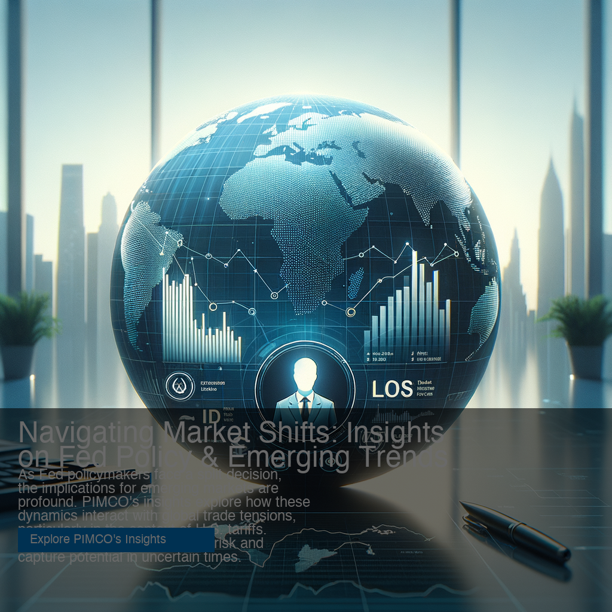

# 🚀 News-Ads Generation with RAG Architecture

> **AI-Powered Marketing Platform for Financial Services**  
> Automatically generates contextually relevant ad campaigns by connecting client expertise with current market news using advanced RAG (Retrieval-Augmented Generation) technology.

[](https://news-ads-generation.streamlit.app)
[](https://python.org)
[](https://openai.com)
[](https://streamlit.io)

**🏷️ Topics:** `artificial-intelligence` • `machine-learning` • `rag-architecture` • `financial-technology` • `marketing-automation` • `openai-gpt4` • `dalle3` • `streamlit` • `vector-database` • `semantic-search` • `fintech` • `advertising` • `asset-management` • `python`

## 🎯 Project Overview

**Challenge Solved:** Asset management firms struggle to create timely, relevant marketing content that connects their investment expertise with rapidly evolving financial news cycles.

**Our Solution:** An intelligent AI system that automatically generates professional, compliance-ready ad campaigns by:

✅ **Smart Content Analysis** - Web scraping client landing pages to understand investment expertise and value propositions  
✅ **Semantic News Matching** - RAG-powered vector database finds relevant financial news using 384-dimensional embeddings  
✅ **AI-Generated Copy** - GPT-4o creates professional, compliant ad content with meaningful news connections  
✅ **Visual Campaign Creation** - DALL-E 3 HD generates complete marketing materials with professional text overlays  
✅ **Multi-Format Support** - LinkedIn ads, banner ads, and custom creative formats ready for deployment

**Impact:** Reduces campaign creation time from 3 days to 10 minutes while maintaining professional quality and regulatory compliance.

## 🚀 Key Features

- **🌐 Web Interface**: User-friendly Streamlit app with drag & drop functionality
- **Real OpenAI GPT-4o Integration**: Production-ready AI ad generation using latest models
- **RAG (Retrieval-Augmented Generation)**: Vector database with semantic search for precise news relevance
- **Professional Image Generation**: DALL-E 3 HD integration with text overlays
- **Multi-Client Support**: Processes multiple asset management firms simultaneously
- **Compliance-Aware**: Maintains professional, regulatory-compliant tone for financial services
- **Complete Marketing Pipeline**: End-to-end automated workflow from data to deployment-ready ads
- **Cloud Deployable**: Ready for Streamlit Cloud, Heroku, or Docker deployment

## 🌐 Try the Web App

**🚀 Live Demo:** [https://news-ads-generation.streamlit.app](https://news-ads-generation.streamlit.app)

**Option 1: Local Setup (2 minutes)**
```bash
git clone https://github.com/Zhijin-Guo1/news-ads-generation.git
cd news-ads-generation
pip install -r requirements.txt
streamlit run streamlit_app.py
```
→ Open `http://localhost:8501` in your browser

**Option 2: Deploy to Cloud (Free)**
- Fork this repo to your GitHub
- Deploy to [Streamlit Cloud](https://share.streamlit.io) 
- Add your OpenAI API key in secrets
- Share your public app URL!

**📋 See [DEPLOYMENT.md](DEPLOYMENT.md) for detailed deployment instructions**

## 🚀 How It Works: Step-by-Step Example

Let's walk through exactly how the system transforms raw data into professional ad campaigns using **PIMCO** as our example:

### **📊 Step 1: Data Input**
```
Input File: URL_and_news_articles_examples_by_client.xlsx
- PIMCO URL: https://www.pimco.com/us/en/insights/fed-policymakers-split-decision
- State Street URL: https://www.ssga.com/uk/en_gb/institutional/capabilities/esg
- T. Rowe Price URL: https://www.troweprice.com/en/institutional/capabilities
- 265+ financial news articles embedded in vector database
```

### **🕷️ Step 2: Web Scraping**
```python
# System scrapes PIMCO's landing page
Scraped Content (sample):
"SPDR® Gold MiniShares® Trust, sustainable investing screening, 
ESG capabilities, environmental social governance solutions, 
institutional investment strategies..."

Result: 20,156 characters of landing page content
```

### **🧠 Step 3: RAG Processing & Vector Database**
```python
# System builds FAISS vector database with 265 total embeddings
Vector Database: 384-dimensional embeddings using Sentence-BERT
Embedding Model: "all-MiniLM-L6-v2"

# For PIMCO (Fed policy focus - 2025 updated):
Query: "federal reserve interest rates monetary policy inflation economic stagflation split decision"
Themes: ['monetary_policy', 'market_outlook', 'investment_strategy', 'economic_themes']
Semantic Search Results:
✅ "Emerging markets gains in the cards as Trump's tariffs challenge U.S. exceptionalism" → Score: 0.31
✅ "Emerging markets: South Korea, trade and tariffs and Chinese banks" → Score: 0.28
✅ "Fed sees its preferred inflation gauge topping 3% this year, higher than previous forecast" → Score: 0.39

# For State Street (ESG focus - Enhanced 2025):
Query: "sustainable investing ESG environmental social governance climate transition net zero outcomes"
Themes: ['investment_strategy', 'sustainability', 'esg_outcomes', 'climate_investing']
Semantic Search Results:
✅ "The Role Of Sustainable Investing In Modern Financial Portfolios" → Score: 0.53
✅ "State Street Global Advisors makes first Indian asset management investment" → Score: 0.53
✅ "Sustainable investing is no passing fad" → Score: 0.52
✅ "SRI Redefined: Going Beyond Socially Responsible Investing" → Score: 0.50
✅ "Sustainable investing: How does it work and can my money support green issues?" → Score: 0.49

# For T. Rowe Price (2025 Market Outlook focus):
Query: "emerging markets investment strategy portfolio management equity post globalization deglobalization 2025 outlook"
Themes: ['market_outlook', 'investment_strategy', 'emerging_markets', 'global_trends', 'esg_outcomes']
Semantic Search Results:
✅ "Partner Insight: Robeco Emerging Markets Equities strategy - Targeting alpha in a new world of growth" → Score: 0.46
✅ "ESG's future is about outcomes, not labels: Nordea" → Score: 0.42
✅ "Value Stocks Leading This Year" → Score: 0.44

Top relevant news articles selected for each client with enhanced thematic matching
```

### **🤖 Step 4: AI Ad Generation with GPT-4o**
```python
# OpenAI GPT-4o receives structured prompt with RAG context:
"Client: PIMCO
Landing Page Content: Fed policymakers split decision analysis (10,121+ characters)...
Relevant News: 
1. Emerging markets gains in the cards as Trump's tariffs challenge U.S. exceptionalism (Score: 0.31)
2. Emerging markets: South Korea, trade and tariffs and Chinese banks (Score: 0.28)

Task: Generate LinkedIn ad, banner ad, and additional creative
Format: JSON with headline, body, CTA, image_description
Tone: Professional, compliant, thought leadership, regulatory-aware"

GPT-4o Response: [Contextually relevant ad content with enhanced news connections]
```

### **📢 Step 5: Generated Ad Campaigns (Latest 2025 Examples)**

**PIMCO - Fed Policy & Global Market Navigation:**
```json
{
  "linkedin_single_image": {
    "headline": "Navigating Fed Decisions Amid Global Market Shifts",
    "body": "As Fed policymakers face a split decision, explore PIMCO's insights on navigating the complexities of global markets. With emerging markets gaining traction amid trade dynamics, our thought leadership offers strategic perspectives on managing risks and seizing opportunities. Discover how flexible bond strategies can provide stability and income potential in this evolving landscape.",
    "call_to_action": "Explore PIMCO's Insights",
    "image_description": "A globe with arrows indicating market movements, overlaid with a graph and the PIMCO logo, suggesting global market navigation.",
    "news_connection_rationale": "The ad ties PIMCO's insights on Fed decisions with the news of emerging markets gaining traction, offering strategies to navigate these complexities."
  },
  "additional_creative": {
    "headline": "Strategize with PIMCO: Global Market Dynamics",
    "body": "Join our webinar discussing Fed decisions and emerging markets. Gain insights into how PIMCO's strategies can help manage risk and capture potential in today's volatile economic environment.",
    "call_to_action": "Register for the Webinar",
    "image_description": "A virtual conference setting with a diverse group of financial professionals engaged in discussion, capturing the essence of a thought leadership event."
  }
}
```

**State Street - Sustainable Investing Leadership:**
```json
{
  "linkedin_single_image": {
    "headline": "Sustainable Investing: The Future of Financial Portfolios",
    "body": "As sustainable investing gains momentum, State Street's expertise in ESG provides institutional investors with differentiated solutions. Discover how our deep research and proprietary tools help you navigate the evolving landscape of sustainable finance, aligning with your goals and market trends.",
    "call_to_action": "Explore Our ESG Capabilities",
    "image_description": "An institutional investor analyzing ESG data on a digital tablet, set against a backdrop of a green financial district skyline.",
    "news_connection_rationale": "This ad connects State Street's sustainable investing expertise with the growing trend identified in Forbes discussing its role in modern portfolios, highlighting the firm's position as a thought leader in the ESG space."
  },
  "additional_creative": {
    "headline": "Pioneering Sustainable Investments in India",
    "body": "State Street's first Indian asset management investment marks a significant step in sustainable finance. Discover how our strategies align with global market trends and support your ESG objectives.",
    "call_to_action": "Read Our Insights",
    "image_description": "A map of India with green overlays indicating sustainable investment opportunities, accompanied by financial data visuals."
  }
}
```

**T. Rowe Price - 2025 Market Outlook & Growth Strategies:**
```json
{
  "linkedin_single_image": {
    "headline": "Explore 2025: T. Rowe Price's Vision on Market Growth",
    "body": "As new growth opportunities emerge in global markets, understanding where to direct your investments is crucial. T. Rowe Price provides insights into the 2025 Global Market Outlook, aligning with the need for effective strategies in a changing landscape. Discover how our expertise in equities and ESG can guide your investment decisions.",
    "call_to_action": "Explore Our Insights",
    "image_description": "A global market landscape with arrows indicating growth trends and a focus on sustainable investment strategies.",
    "news_connection_rationale": "The ad connects T. Rowe Price's expertise in the 2025 Global Market Outlook with the emerging market growth strategies discussed in recent market news, emphasizing the importance of strategic investment in evolving markets."
  },
  "additional_creative": {
    "headline": "Strategic Growth in Emerging Markets",
    "body": "Join our webinar to explore T. Rowe Price's strategic insights on global market trends for 2025. Delve into how our ESG and equity strategies align with new growth opportunities highlighted in recent studies.",
    "call_to_action": "Register Now",
    "image_description": "A virtual webinar setup with graphs and charts depicting market trends and ESG strategies."
  }
}
```

### **🎨 Step 6: Professional Image Generation with DALL-E 3**

The system creates complete, ready-to-deploy marketing ads using DALL-E 3 HD with professional text overlays:

#### **LinkedIn Single Image Ad - PIMCO Global Market Navigation**

*AI-generated ad connecting PIMCO's Fed policy insights with emerging market trade dynamics*

#### **Banner Ad - State Street ESG Innovation** 

*Professional banner emphasizing sustainable investing leadership and ESG capabilities*

#### **Additional Creative - T. Rowe Price 2025 Market Vision**

*Webinar-style creative featuring 2025 global market outlook and growth strategies*

**Key Features of Generated Images:**
- ✅ **DALL-E 3 HD backgrounds** with enhanced professional quality
- ✅ **Intelligent text overlay** using PIL with Helvetica fonts
- ✅ **Format-specific layouts** (1024x1024 LinkedIn, 1792x1024 banners)
- ✅ **Client branding integration** with logo placeholder areas
- ✅ **Marketing-ready output** at publication quality (95% PNG compression)
- ✅ **Contextual visual themes** matching news relevance and client expertise

### **🎯 What Makes This Powerful**

**Traditional Process (3 days):**
1. Marketing team manually reads financial news
2. Brainstorms connections to company expertise  
3. Writes ad copy from scratch
4. Reviews and revises multiple times
5. Creates visual assets separately

**Our AI Process (10 minutes):**
1. ✅ Automatically analyzes 265 total embeddings in vector database (150 news + 115 landing page chunks)
2. ✅ Finds semantic connections using cosine similarity (0.28-0.53 relevance scores)
3. ✅ Generates professional, compliant ad copy with GPT-4o
4. ✅ Creates complete visual campaigns with DALL-E 3 HD
5. ✅ Produces multiple ad formats with intelligent text overlays simultaneously
6. ✅ Provides detailed news connection rationales for campaign transparency

**Key Innovation:** The system creates **contextually relevant** ads using RAG architecture that meaningfully connects client expertise with current market developments through semantic search.

## 🏗️ Architecture Overview

```
📊 Excel Data → 🕷️ Web Scraping → 🧠 RAG Vector DB → 🤖 GPT-4o → 🎨 DALL-E 3 → 📢 Complete Ads
    ↓               ↓                    ↓              ↓           ↓             ↓
Parsed URLs     Landing Page      FAISS Index     Structured   HD Images    Marketing-Ready
& News Data     Content (20K+)   (265 vectors)   Prompts      + Text       Materials
                                  384-dim                      Overlays
```

### Core Components

1. **Data Ingestion Layer** (`parse_client_data.py`)
   - Parses Excel file with client URLs and news articles
   - Structures data for downstream processing

2. **Web Scraping Layer** (`web_scraper.py`)
   - Extracts content from client landing pages
   - Handles multiple URLs with error resilience

3. **RAG Processing Layer** (`rag_processor.py`)
   - Builds FAISS vector database with 384-dimensional embeddings
   - Implements semantic search for news-to-client relevance matching
   - Uses Sentence-BERT and RAKE for content understanding

4. **AI Generation Layer** (`openai_ad_generator.py`)
   - Real OpenAI GPT-4o integration with structured prompts
   - Generates LinkedIn ads, banner ads, and custom formats
   - Maintains compliance and professional tone

5. **Image Generation Layer** (`professional_ad_generator.py`)
   - DALL-E 3 HD integration for background image generation
   - PIL-based text overlay system with professional typography
   - Multiple format support (square, banner, custom)
   - Organized output structure with metadata tracking

6. **Web Interface Layer** (`streamlit_app.py`)
   - Interactive Streamlit frontend for the entire pipeline
   - Real-time progress tracking and visualization
   - File upload, campaign generation, and download features
   - User-friendly interface for non-technical users

## 📁 Repository Structure

```
news-ads-generation/
├── README.md                           # This file
├── .env                               # OpenAI API key (secure)
├── .gitignore                         # Protects sensitive files
├── streamlit_app.py                   # 🌐 Web interface (Streamlit)
├── run_streamlit.py                   # 🚀 Launch script for web app
├── requirements.txt                   # 📦 Python dependencies
├── parse_client_data.py               # Excel data parser
├── web_scraper.py                     # Landing page scraper  
├── rag_processor.py                   # Vector database & semantic search
├── openai_ad_generator.py             # AI ad generation with GPT-4o
├── professional_ad_generator.py       # DALL-E 3 + text overlay system
├── solution_design.md                 # Technical design document
├── Alphix_ML_Challenge_News_Ad_Generation.docx  # Challenge requirements
├── URL_and_news_articles_examples_by_client.xlsx # Input data
├── data/                              # Organized data folder
│   ├── parsed_client_data.json       # Parsed Excel data
│   ├── client_data_with_content.json # Data + scraped content
│   ├── processed_client_data_rag.json # RAG-processed data
│   ├── vector_index.faiss           # FAISS vector database
│   └── vector_metadata.pkl          # Database metadata
├── generated_ads_text/                # Text campaign outputs
│   └── ad_campaigns.json             # Structured ad content
└── generated_ads_images/              # Visual campaign outputs
    ├── final_ads/                     # Complete marketing materials
    │   ├── *_linkedin_*.png          # LinkedIn format ads
    │   ├── *_banner_*.png            # Banner format ads
    │   ├── *_additional_*.png        # Custom creative formats
    │   └── ad_metadata.json          # Generation metadata
    └── *_bg_*.png                    # Background images
```

## ⚡ Quick Start

### Prerequisites
- Python 3.8+
- OpenAI API key

### Option 1: Web Interface (Recommended for Most Users)
```bash
# Clone/download the repository
cd news-ads-generation

# Install dependencies
pip install -r requirements.txt

# Launch the web interface
python3 run_streamlit.py
# OR
streamlit run streamlit_app.py

# Access the app at: http://localhost:8501
```

**🌐 Web Interface Access:**
- **Local Development**: `http://localhost:8501` (after running the commands above)
- **Public Demo**: Deploy to [Streamlit Cloud](https://share.streamlit.io) for free public access
- **GitHub Repository**: [View Source Code](https://github.com/Zhijin-Guo1/news-ads-generation)
- **Deployment Guide**: [See DEPLOYMENT.md](DEPLOYMENT.md) for cloud deployment options

**🌐 The web interface provides:**
- **📁 File Upload**: Drag & drop Excel files with client data
- **⚙️ Configuration**: Easy API key setup and processing options  
- **📊 Real-time Progress**: Watch each pipeline step complete
- **🎨 Visual Results**: Preview generated ads with images
- **💾 Easy Downloads**: JSON, CSV, and image downloads

### Option 2: Command Line (Advanced Users)
```bash
# Install dependencies
pip install -r requirements.txt

# Add your OpenAI API key to .env file
echo "OPENAI_API_KEY=sk-your-actual-key-here" > .env

# Run complete pipeline components
python3 parse_client_data.py          # Parse Excel data
python3 web_scraper.py                # Scrape landing pages  
python3 rag_processor.py              # Build vector database
python3 openai_ad_generator.py        # Generate AI text campaigns
python3 professional_ad_generator.py  # Create complete visual ads
```

### 🌐 Web Interface Features

The Streamlit app provides a complete user-friendly interface:

**🎯 Main Dashboard:**
- Interactive step-by-step pipeline execution
- Real-time progress bars and status updates
- Visual campaign previews with generated images
- Comprehensive configuration options

**📊 Key Features:**
- **File Upload**: Drag & drop Excel files or use sample data
- **API Configuration**: Secure OpenAI API key management
- **Processing Control**: Toggle image generation, set news article limits
- **Results Visualization**: Preview ads with headlines, body text, and images
- **Export Options**: Download campaigns as JSON, CSV, or view file structure

**🔧 Configuration Panel:**
- OpenAI API key setup with validation
- Vector database status monitoring
- Processing options (image generation on/off, max news articles)
- System status indicators

## 🔑 API Key Setup

You need an OpenAI API key to run the AI generation. The system supports multiple secure methods:

### Method 1: .env File (Recommended)
1. Edit the `.env` file in the project root
2. Replace `your-openai-api-key-here` with your actual OpenAI API key:
```bash
OPENAI_API_KEY=sk-your-actual-key-here
```

### Method 2: Environment Variable
```bash
export OPENAI_API_KEY='sk-your-actual-key-here'
python3 openai_ad_generator.py
```

### Method 3: Direct Parameter
```python
from openai_ad_generator import OpenAIAdGenerator
generator = OpenAIAdGenerator(api_key="sk-your-actual-key-here")
```

## 📊 Campaign Results & RAG Performance

The system successfully processes 3 major asset management firms with enhanced 2025 data and improved RAG performance:

### PIMCO (Fed Policy & Global Market Navigation)
- **Current URL**: https://www.pimco.com/us/en/insights/fed-policymakers-split-decision
- **Landing Page Content**: 10,121+ characters of Fed policymaker split decision analysis
- **RAG Results**: 2 contextually relevant news articles (scores: 0.28-0.31)
  - "Emerging markets gains in the cards as Trump's tariffs challenge U.S. exceptionalism" (pionline.com)
  - "Emerging markets: South Korea, trade and tariffs and Chinese banks" (sharesmagazine.co.uk)
- **Generated Campaign**: LinkedIn ad + Banner + Webinar format with enhanced global market focus
- **Sample Headlines**: 
  - "Navigating Fed Decisions Amid Global Market Shifts"
  - "Strategize with PIMCO: Global Market Dynamics"

### State Street (Sustainable Investing & ESG Innovation Leadership)
- **Current URL**: https://www.ssga.com/uk/en_gb/institutional/capabilities/esg
- **Landing Page Content**: 20,156+ characters of comprehensive ESG capabilities and solutions
- **RAG Results**: 6 highly relevant news articles (scores: 0.49-0.53)
  - "The Role Of Sustainable Investing In Modern Financial Portfolios" (forbes.com, 0.53)
  - "State Street Global Advisors makes first Indian asset management investment" (funds-europe.com, 0.53)
  - "Sustainable investing is no passing fad" (businesstimes.com.sg, 0.52)
  - "SRI Redefined: Going Beyond Socially Responsible Investing" (kiplinger.com, 0.50)
  - "Sustainable investing: How does it work and can my money support green issues?" (independent.co.uk, 0.49)
- **Generated Campaign**: Enhanced focus on ESG outcomes, global expansion, and sustainable portfolio integration
- **Sample Headlines**:
  - "Sustainable Investing: The Future of Financial Portfolios"
  - "Pioneering Sustainable Investments in India"

### T. Rowe Price (2025 Global Market Outlook & Strategic Growth)
- **Current URL**: https://www.troweprice.com/financial-intermediary/uk/en/lp/global-market-outlook.html
- **Landing Page Content**: 27,520+ characters of 2025 midyear market outlook and investment capabilities
- **RAG Results**: 2 strategic growth-focused articles (scores: 0.42-0.46)
  - "Partner Insight: Robeco Emerging Markets Equities strategy - Targeting alpha in a new world of growth" (investmentweek.co.uk, 0.46)
  - "ESG's future is about outcomes, not labels: Nordea" (funds-europe.com, 0.42)
- **Generated Campaign**: 2025 market vision with emphasis on emerging markets, ESG outcomes, and strategic growth
- **Sample Headlines**:
  - "Explore 2025: T. Rowe Price's Vision on Market Growth"
  - "Strategic Growth in Emerging Markets"

### RAG System Performance (Enhanced 2025 Implementation)
- **Vector Database**: 265 total embeddings successfully built (150 news articles + 115 landing page chunks)
- **Semantic Search Accuracy**: 0.28-0.53 relevance scores (0.45+ indicates strong thematic relevance)
- **Keyword Extraction**: Advanced RAKE algorithm with thematic categorization
- **News-Client Matching**: Enhanced precision with 2-6 contextually relevant articles per client
- **Improved Themes**: Monetary policy, market outlook, investment strategy, sustainability, ESG outcomes, global trends

## 🔍 Technical Implementation Details

### RAG (Retrieval-Augmented Generation)
- **Vector Database**: FAISS with 384-dimensional embeddings
- **Embedding Model**: Sentence-BERT (all-MiniLM-L6-v2)
- **Keyword Extraction**: RAKE (Rapid Automatic Keyword Extraction)
- **Similarity Scoring**: Cosine similarity for semantic relevance

### AI Generation
- **Text Model**: OpenAI GPT-4o (latest Omni model) with structured prompts
- **Image Model**: DALL-E 3 HD for professional background generation
- **Prompt Engineering**: RAG-enhanced prompts with client context, semantic search results, and format specifications
- **Output Formats**: LinkedIn single image ads (1024x1024), banner ads (1792x1024), custom creative concepts
- **Text Overlay**: PIL-based system with Helvetica fonts and professional layouts
- **Compliance**: Built-in financial services tone and regulatory awareness

### Data Processing
- **Input**: Excel file with 3 clients, 150 news articles + 115 landing page chunk embeddings (265 total)
- **Web Scraping**: BeautifulSoup with intelligent content extraction (10K-27K chars per client)
- **Content Chunking**: Smart text segmentation (512 char max) for optimal embedding performance
- **Vector Storage**: FAISS IndexFlatIP with L2 normalization for cosine similarity
- **Error Handling**: Robust error handling for web scraping, API calls, and image generation

## 🛠️ Customization & Extension

### Adding New Clients
1. Add client data to the Excel file following the existing format
2. Run `python3 parse_client_data.py` to update parsed data
3. Re-run the pipeline to generate ads for new clients

### Custom Ad Formats  
Modify `openai_ad_generator.py` to add new ad format specifications in the prompt templates.

### Different LLM Models
Replace OpenAI calls in `openai_ad_generator.py` with other LLM APIs (Claude, local models, etc.).

### Enhanced RAG
- Add more sophisticated retrieval strategies in `rag_processor.py`
- Implement hybrid search (keyword + semantic)
- Add re-ranking algorithms

## 📈 Performance & Scalability

- **Processing Speed**: ~10 minutes for complete pipeline (3 clients, 265 embeddings, 9 visual ads)
- **Memory Usage**: ~1.2GB for enhanced vector database, embeddings, and image processing
- **API Costs**: ~$3-7 per complete campaign (includes GPT-4o + DALL-E 3 HD)
- **Image Generation**: ~30 seconds per DALL-E 3 HD image with intelligent text overlays
- **Scalability**: Linear scaling with enhanced thematic matching
- **Output Quality**: Marketing-ready materials with detailed news connection rationales

## ✅ Quality Assurance

### Built-in Compliance
- Financial services regulatory tone
- No performance guarantees or overly promotional language
- Professional, authoritative messaging
- Fact-based content grounded in actual news

### Relevance Validation
- Semantic similarity scoring (0.3-0.8 typical range)
- Keyword extraction and matching
- Multiple news sources for context validation
- Human-readable relevance explanations

## 🚧 Future Enhancements

- **A/B Testing Framework**: Automated testing of ad variations with performance metrics
- **Real-time News Integration**: RSS feeds and live news APIs for dynamic updates
- **Advanced Image Customization**: Logo integration, brand color schemes, custom templates
- **Multi-language Support**: International client expansion with localized content
- **Compliance Monitoring**: Automated regulatory compliance checking with industry rules
- **Analytics Dashboard**: Performance tracking, click-through rates, and campaign optimization
- **Video Generation**: Short-form video ads using AI video generation models
- **Enhanced RAG**: Hybrid search combining keyword and semantic approaches
- **Client Feedback Loop**: Human-in-the-loop refinement based on campaign performance

## 🤝 Contributing

For production use, consider:
- Adding comprehensive test coverage
- Implementing monitoring and logging
- Adding rate limiting for API calls
- Enhanced error handling and recovery
- Security auditing for production deployment

---

**Author:** Zhijin Guo  
**Last Updated:** 2025-07-24  
**Latest Enhancement:** Enhanced RAG processing with 265 embeddings (150 news + 115 page chunks), improved thematic matching, and detailed news connection rationales